# iM뱅크 법인 고객 금융 DNA 기반 타지역 진출 후보 분석

## 1. Project Overview

대구·경북 우수 법인 고객의 금융 거래 패턴을 머신러닝과 클러스터링으로 정의하고,  
코사인 유사도를 활용해 타지역 내 유사한 기업금융 거점 후보를 탐색한 프로젝트입니다.

본 프로젝트는 단순히 예대마진을 예측하는 데서 끝나지 않고,  
예측 모델을 통해 도출한 핵심 변수를 기반으로 타지역 영업 후보지를 정량적으로 탐색하는 데 목적이 있습니다.

---

## 2. Problem Definition

iM뱅크는 시중은행 전환 이후 타지역 진출 필요성이 커졌습니다.  
하지만 무분별한 지점 확장은 비용 리스크가 크기 때문에, 기존 강점 지역인 대구·경북의 우수 법인 고객 패턴을 기반으로 타지역의 유사 고객군과 후보 지역을 탐색할 필요가 있습니다.

따라서 본 프로젝트는 다음 질문에서 출발했습니다.

> 대구·경북에서 검증된 우수 법인 고객의 금융 DNA와 유사한 타지역 후보지는 어디인가?

---

## 3. Analysis Pipeline

1. 예대마진 변수 생성
2. 회귀 모델 비교
3. RandomForest 기반 예대마진 예측 모델 구축
4. Optuna 기반 하이퍼파라미터 튜닝
5. Feature Importance 및 SHAP 기반 핵심 변수 해석
6. 대구·경북 우수 고객군 1차 KMeans 클러스터링
7. 대구·경북 우수집단과 타지역 데이터 결합
8. 2차 KMeans 클러스터링 수행
9. 코사인 유사도 기반 유사 지역 도출
10. 최종 영업 후보 지역 제안

---

## 4. Data & Target Variable

본 프로젝트는 iM뱅크 교육용 법인 고객 금융거래 데이터를 활용했습니다.  
원본 고객 데이터와 금리현황 데이터는 보안 및 저작권 문제로 저장소에 포함하지 않았습니다.

예대마진은 고객별 예금·대출 잔액과 2022~2024년 월별 금리 데이터를 결합하여 산출했습니다.

- 예금이자 = 총예금잔액 × 평균예금금리
- 대출이자 = 총대출잔액 × 평균대출금리
- 예대마진 = 대출이자 - 예금이자

---

## 5. Model Selection

예대마진 예측을 위해 주요 회귀 모델을 비교했습니다.  
모델 비교 결과 RandomForestRegressor가 가장 안정적인 성능을 보여 최종 모델로 선정했습니다.

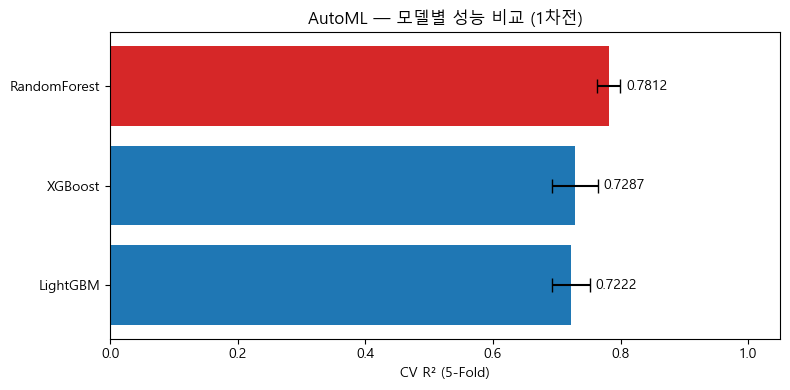

이후 Optuna를 활용해 RandomForestRegressor의 하이퍼파라미터 튜닝을 수행했습니다.  
튜닝은 교차검증 기반 R²를 최적화 지표로 설정하여 진행했습니다.

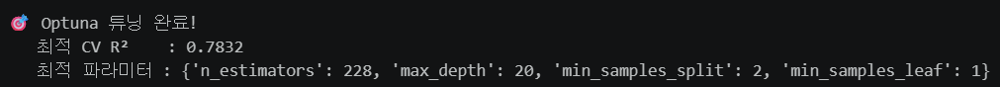

| 항목 | 결과 |
|---|---:|
| Tuning Library | Optuna |
| Final Model | RandomForestRegressor |
| Best CV R² | 0.7832 |
| n_estimators | 228 |
| max_depth | 20 |
| min_samples_split | 2 |
| min_samples_leaf | 1 |

Optuna 튜닝을 통해 최종 모델의 하이퍼파라미터를 확정한 뒤, 해당 모델을 기반으로 Test 데이터 예측 성능과 변수 중요도를 분석했습니다.

---

## 6. Final Model Performance

Optuna 튜닝으로 확정한 RandomForestRegressor를 Test 데이터에 적용한 결과, 예대마진 예측에서 일정 수준 이상의 설명력을 확보했습니다.

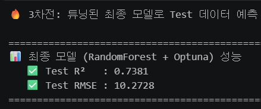

| 항목 | 결과 |
|---|---:|
| 최종 모델 | RandomForestRegressor + Optuna |
| 타겟 변수 | 예대마진 |
| Test R² | 0.7381 |
| Test RMSE | 10.2728 |

CV 기준 R²는 0.7832, Test R²는 0.7381로 나타나 학습 과정에서 확인한 설명력이 Test 데이터에서도 비교적 안정적으로 유지되었습니다.

---

## 7. Feature Importance & SHAP

Feature Importance를 통해 예대마진 예측에 영향을 주는 핵심 변수를 확인했습니다.

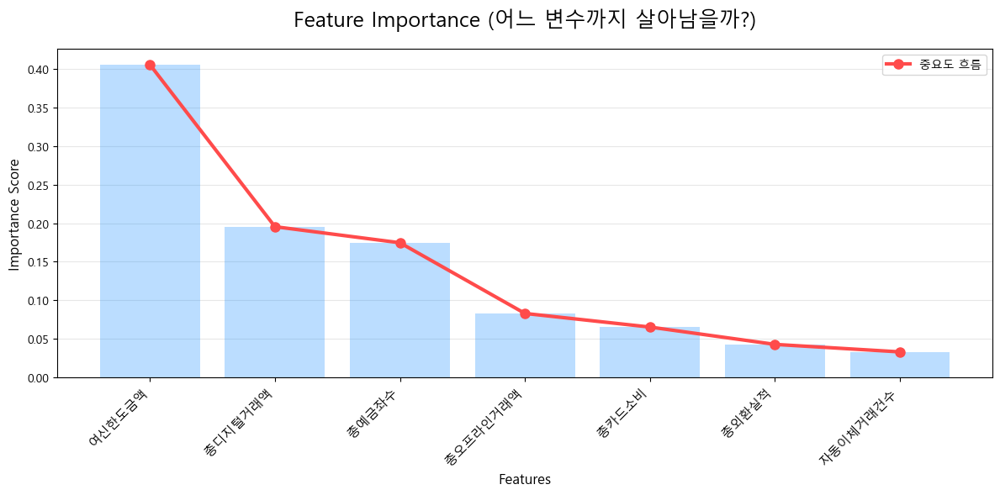

SHAP 분석을 통해 변수별 영향 방향도 함께 확인했습니다.

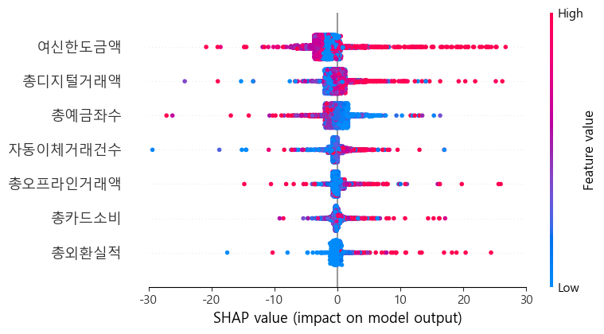

핵심 변수는 다음과 같이 해석했습니다.

| 변수 | 해석 |
|---|---|
| 여신한도금액 | 기업의 여신 잠재력 |
| 총디지털거래액 | 디지털 채널 기반 활동성 |
| 총예금좌수 | 고객과 은행 간 거래 관계 깊이 |
| 예대마진 | 수익성 판단의 핵심 타겟 변수 |

이 결과를 바탕으로 수익성과 관련된 핵심 금융 지표를 중심으로 대구·경북 우수 고객군의 금융 패턴을 정의했습니다.

---

## 8. 1st Clustering: 대구·경북 우수집단 정의

대구·경북 법인 고객을 대상으로 1차 KMeans 클러스터링을 수행했습니다.  
K값은 Elbow와 Silhouette 분석을 함께 고려하여 선정했습니다.

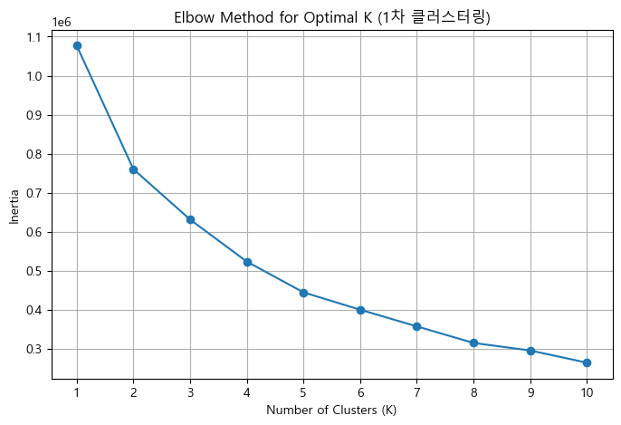

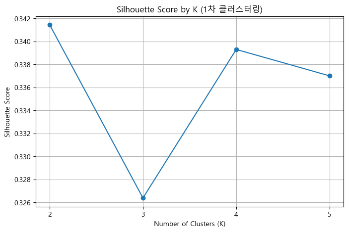

1차 클러스터링을 통해 대구·경북 내부에서 수익성, 거래 깊이, 여신 잠재력, 디지털 활동성이 높은 우수 고객군을 정의했습니다.

---

## 9. 2nd Clustering: 타지역 확장 후보 탐색

1차 클러스터링에서 정의한 대구·경북 우수 고객군과 타지역 데이터를 결합한 뒤, 2차 KMeans 클러스터링을 수행했습니다.  
이 과정에서 대구·경북 우수 고객군과 타지역 고객이 함께 포함된 군집을 최종 분석 대상으로 선정했습니다.

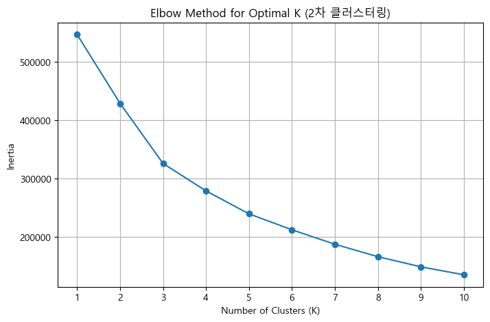

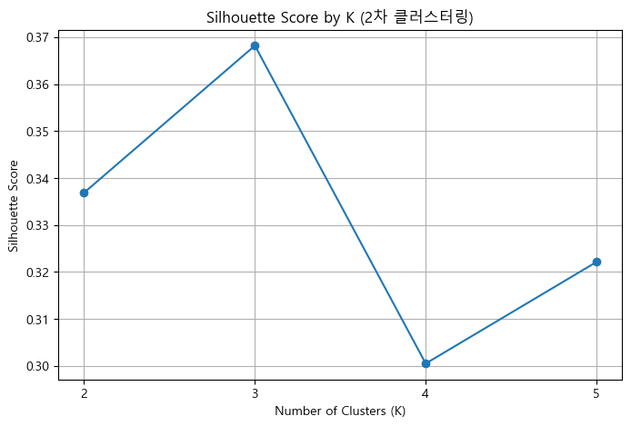

클러스터 번호는 실행 시점에 따라 달라질 수 있으므로, 포트폴리오용 최종 코드에서는 특정 번호를 고정하지 않고 대구·경북 우수집단과 타지역 고객이 함께 포함된 군집을 조건 기반으로 선택했습니다.

---

## 10. Cosine Similarity Analysis

최종 군집 내부에서 대구·경북 우수 고객군을 기준 벡터로 설정하고,  
타지역별 금융 지표 중앙값 벡터와의 코사인 유사도를 계산했습니다.

코사인 유사도는 절대 규모보다 금융 거래 패턴의 방향성을 비교하는 데 적합하므로,  
타지역 고객군이 대구·경북 우수 고객군과 얼마나 유사한 금융 DNA를 가지는지 확인하는 데 활용했습니다.

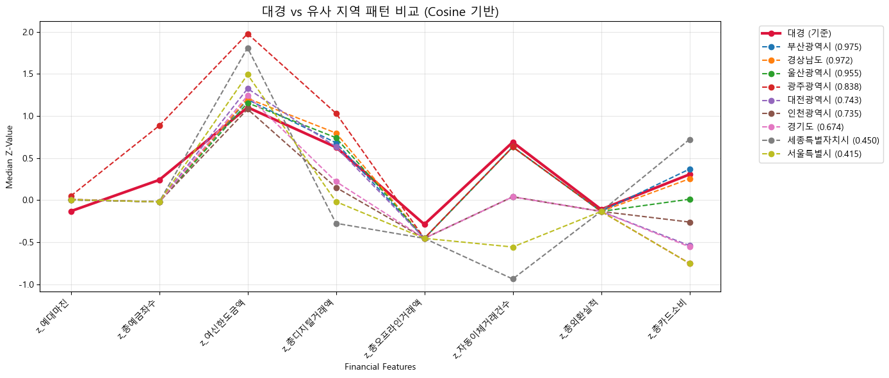

최종적으로 부산광역시, 경상남도, 울산광역시가 대구·경북 우수 고객군과 높은 유사도를 보이는 후보 지역으로 도출되었습니다.

---

## 11. Final Result

최종 분석 결과는 다음과 같습니다.

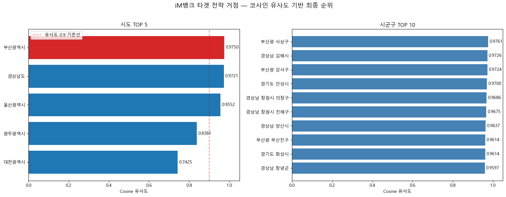

| 순위 | 지역 | 해석 |
|---|---|---|
| 1 | 부산광역시 | 동남권 기업금융 요충지 |
| 2 | 경상남도 | 제조업·산단 기반 기업금융 후보지 |
| 3 | 울산광역시 | 제조업 중심 운전자금 수요 후보지 |
| 4 | 광주광역시 | 지역 중소기업 기반 기업금융 후보지 |
| 5 | 대전광역시 | 연구개발·기술 기반 중소기업이 밀집한 충청권 후보지 |

---

## 12. Business Insight

본 프로젝트의 핵심은 대구·경북 우수 법인 고객군의 금융 패턴을 타지역으로 확장 적용할 수 있는지 확인한 것입니다.

분석 결과, 대구·경북 우수 고객군과 유사한 금융 패턴은 부산·경남·울산을 중심으로 높게 나타났습니다.  
이는 제조업, 운전자금 수요, 기업금융 거래 가능성이 높은 지역에서 대구·경북의 우수 고객 DNA와 유사한 패턴이 반복될 수 있음을 시사합니다.

### Phase 1 — 우선 진출 후보

- 부산광역시
- 경상남도
- 울산광역시

이들 지역은 대구·경북 우수 고객군과의 금융 패턴 유사도가 높아, 기업금융 영업 우선순위가 높은 후보지로 해석할 수 있습니다.

### Phase 2 — 중기 진출 후보

- 광주광역시
- 대전광역시

광주는 제조업·중소기업 기반의 기업금융 수요 확인 지역으로,  
대전은 연구개발·기술 기반 중소기업이 밀집한 충청권 후보지로 해석할 수 있습니다.

### 핵심 영업 전략

| 구분 | 내용 |
|---|---|
| 여신 | 운전자금 대출, 보증 연계 대출, 기술기업 성장자금 지원 |
| 수신 | 급여이체·결제계좌 선점, 기업 운영자금 예치 유도 |
| 채널 | 디지털 채널 활용 기업 대상 비대면 온보딩 강화 |
| 관계 | 자동이체·결제계좌 확대를 통한 장기 주거래 고객화 |

---

## 13. Key Contributions

- 회귀 모델 비교와 Optuna 하이퍼파라미터 튜닝을 통해 최종 RandomForest 모델을 선정했습니다.
- 예대마진 예측 모델을 통해 수익성 핵심 변수를 도출했습니다.
- Feature Importance와 SHAP을 활용해 모델 해석 가능성을 확보했습니다.
- 대구·경북 우수 고객군을 클러스터링 기반으로 정의했습니다.
- 타지역 데이터와 결합해 유사 고객군을 탐색했습니다.
- 코사인 유사도를 활용해 타지역 후보지를 정량적으로 랭킹화했습니다.
- 단순 예측 모델이 아니라, 금융기관의 타지역 영업 전략을 위한 의사결정 파이프라인을 설계했습니다.

---

## 14. Limitations

- 원본 금융 데이터와 금리 데이터는 공개할 수 없어 저장소에 포함하지 않았습니다.
- 원본 데이터가 없으면 노트북 전체 재실행은 어렵습니다.
- 실제 영업점 성과, 고객 유지율, 여신 실행률과 연결한 검증은 수행하지 못했습니다.
- 향후 지역별 산업단지, 기업체 수, 정책금융 수요 데이터를 추가하면 분석 신뢰도를 높일 수 있습니다.

---

## 15. Repository Structure

- `README.md`
- `requirements.txt`
- `.gitignore`
- `notebooks/`
  - `ml_project_final_psm.ipynb`
- `docs/`
  - `data_description.md`
- `images/`
  - `model_comparison.png`
  - `optuna.png`
  - `final_model_performance.png`
  - `feature_importance.png`
  - `shap_value.png`
  - `1st_elbow.png`
  - `1st_silhouette.png`
  - `2nd_elbow.png`
  - `2nd_silhouette.png`
  - `cosine.png`
  - `final.png`